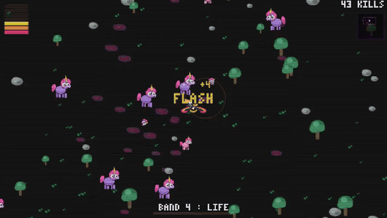

# ROYGBIV

js13kGames 2026 entry, themed *Unicorns and Rainbows*.

Everyone talks about unicorns. The rainbow never gets a good part in the story. That changes tonight.

A top-down roguelite shooter where you play the rainbow, armed with a pump-action shotgun, against a horde of sickeningly cute unicorns.



## Source

`src/index-80.html` is the single hand-edited game source: an 80s arcade cabinet with nearest-neighbour scaling, scanlines, a 3x5 bitmap font, and a black background. Open it directly in a browser during development.

`src/font3x5.txt` keeps the encoded glyphs as a reference. The same data is embedded in the source's `FONT` constant; the game has no external assets. Keep both copies in sync if the glyphs change. There is no generation step.

## Building

```sh
npm run build
```

The build produces:

| File | Role |
|---|---|
| `js13k-game.zip` | Contest archive, with `index.html` at its root |
| `dist/js13k/index.html` | Compressed page matching the archive |
| `dist/wavedash/index.html` | Uncompressed page for Wavedash |

The chain extracts the script, runs Terser and Roadroller, creates the ZIP, and measures it. `advzip` is optional. Roadroller is randomized, so the build makes four attempts and keeps the smallest result; use `TRIES=12 bash build.sh` when the margin is tight.

The build checks the archive filename, both script tags, and the viewport tag. The archive limit is 13,312 bytes.

## Testing

```sh
npm test
```

The Node tests exercise the title screen, level-ups, combat, damage, death, victory, layout at four viewport sizes, and the Wavedash integration. The Terser Wavedash pass catches API calls that minification could break.

## Wavedash

The game targets the Wavedash challenge alongside the js13k entry. The guarded integration at the end of `src/index-80.html` is inert outside the platform. It provides ten achievements, two leaderboards, and an in-game achievement toast.

| File | Role |
|---|---|
| `wavedash-achievements.json` | Achievement definitions for the developer portal |
| `wavedash.toml` | Points `upload_dir` at `dist/wavedash/` |
| `media/gameplay-wavedash.mp4` | Ten-second, 16:9, silent gameplay video |
| `media/gameplay.gif` | Animated GIF extracted from the same video |

Achievements must exist in the developer portal before the game triggers them. Local definitions do not prove that the portal is up to date.

## Gameplay video

The capture script drives the character, waits until the second upgrade choice, then records ten seconds with several enemies on screen. It requires Python Playwright, Chromium, and `ffmpeg`.

```sh
python3 scripts/record-gameplay.py
bash scripts/make-gameplay-gif.sh
```

The video is H.264, 1280x720, 30 fps, without audio. The GIF uses the same ten seconds at a smaller resolution and frame rate.

## Controls

| Input | Action |
|---|---|
| Arrows or WASD / ZQSD | Move |
| Touch anywhere | Virtual joystick |
| 1, 2, 3 | Choose a power |
| M | Toggle sound |

Aiming and firing are automatic. The shotgun fires only when an enemy is within range.

## License

MIT.
